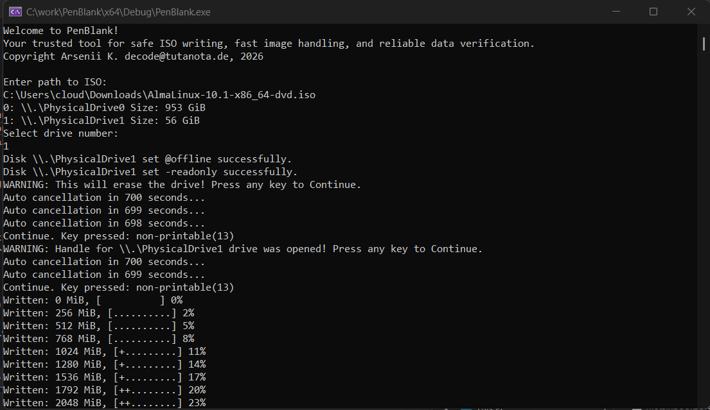
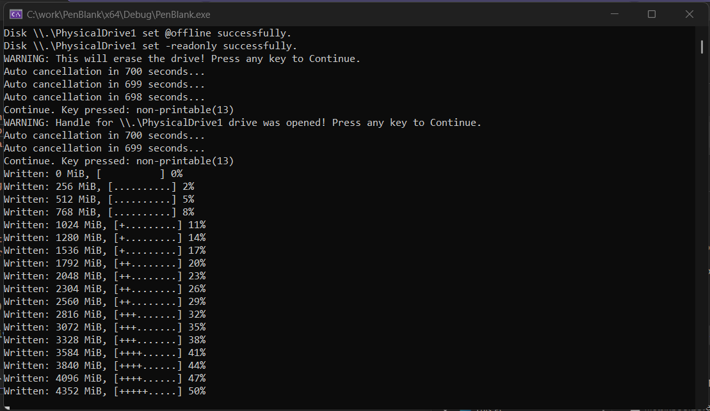
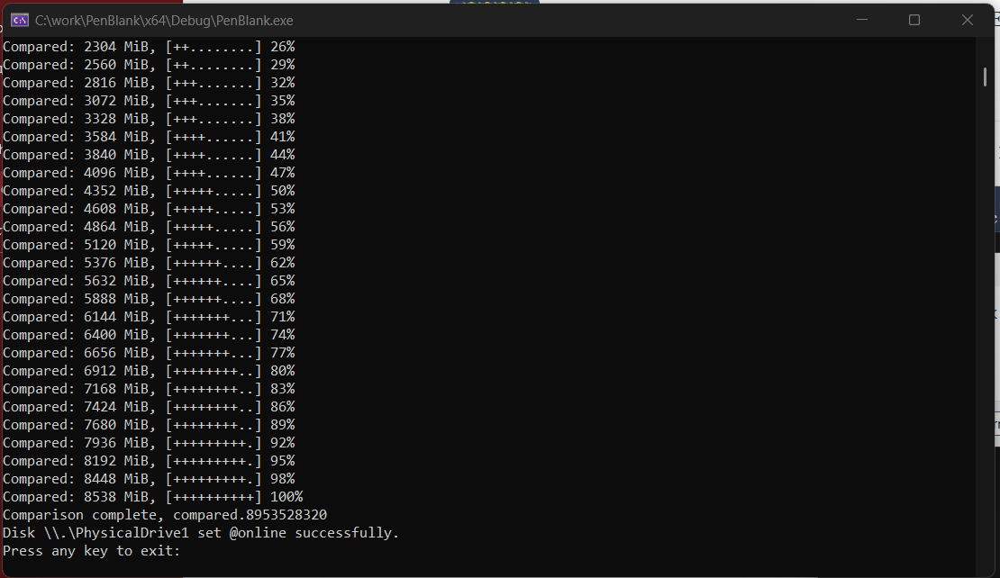
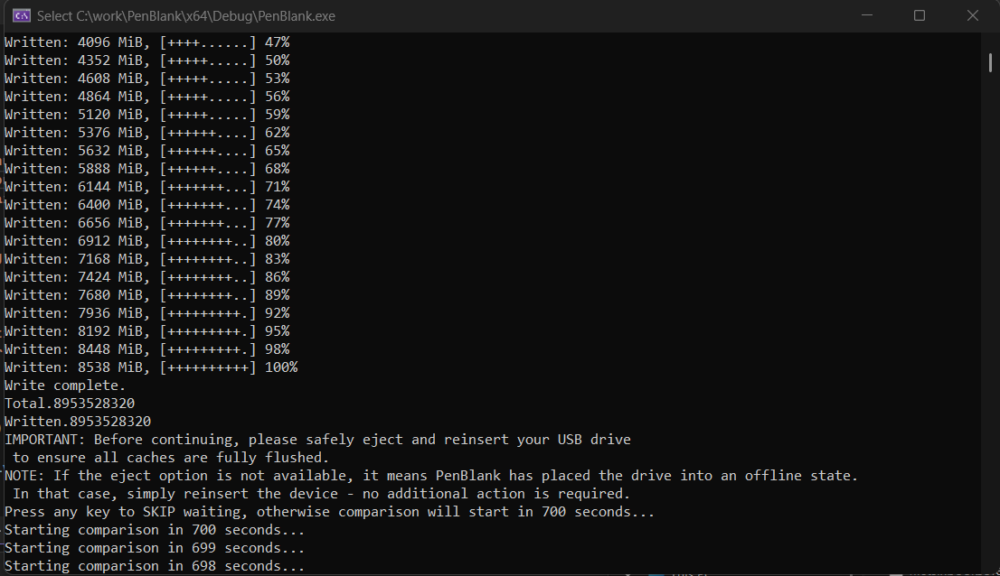

# PenBlank

PenBlank is a trusted utility for **safe ISO writing**, **fast image handling**, and **reliable data verification** on Windows.

It provides a careful workflow for writing ISO images to USB drives, ensuring data integrity with built-in comparison checks.

---

## ✨ Features

* List all available physical drives with size information.
* Set drives **offline** or toggle **read-only** attributes for safety.
* Confirm destructive operations with countdown-based cancellation.
* Write ISO images directly to USB drives with progress logging.
* Compare written data against the original ISO for verification.
* Safe eject and reinsertion guidance to flush caches.

---

## ⚙️ Usage

1. Run the program.

2. Enter the path to your ISO file.

3. Select the target physical drive.

4. Confirm destructive operation (with countdown safety).

5. ISO will be written with progress updates.

6. Optionally verify the written data against the ISO.

---

## 📸 Screenshots

### 1. Drive Listing

### 2. ISO Writing Progress

### 3. Comparison Verification

### 4. Safe Eject Reminder

---

## 🔒 Safety Notes

* PenBlank places drives **offline** during operations to prevent accidental usage.
* Always double-check the selected drive before confirming.
* The tool requires administrator privileges to access physical drives.

---

## 📜 License

Copyright © Arsenii K. decode@tutanota.de, 2026

All rights reserved.

